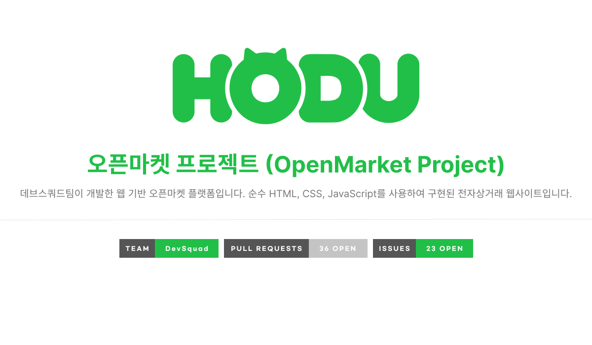

<!--Banner-->
 


## 프로젝트 개요

이 문서는 'Devsquad' 팀이 진행한 바닐라 JS 기반 오픈마켓 서비스 프로젝트의 목표, 기능, 아키텍처, 팀원 역할 및 협업 과정을 상세히 기술한 문서입니다.

### 1. 목표와 기능

#### 1.1. 목표
본 프로젝트의 핵심 목표는 프레임워크의 도움 없이 순수 Vanilla JS만을 사용하여 웹 애플리케이션의 전체적인 구조를 설계하고 구현하는 경험을 쌓는 것입니다. 이를 통해 아래와 같은 세부 목표를 달성하고자 했습니다.

* **기술 목표**: Vanilla JS를 사용하여 컴포넌트 기반의 동적 MPA(Multi-Page Application)를 개발하고, 비동기 통신과 상태 관리의 기본 원리를 깊이 있게 이해합니다.
* **협업 목표**: Git-flow 전략에 기반한 버전 관리, Pull Request를 통한 코드 리뷰, 정기적인 소통을 통해 실전적인 팀 협업 프로세스를 경험하고 함께 성장합니다.
* **설계 목표**: 향후 유지보수와 기능 확장을 고려하여, 기능별로 책임이 명확히 분리된 모듈화 아키텍처를 설계하고 구현합니다.

#### 1.2. 기능
본 프로젝트에서 구현된 핵심 기능은 다음과 같습니다.

| 구분 | 주요 기능 | 상세 설명 |
| :--- | :--- | :--- |
| **회원 인증** | 로그인/로그아웃 | JWT 토큰 기반의 인증을 처리하며, 로그인 성공 시 이전 페이지로 리다이렉트됩니다. |
| | 회원가입 | 아이디 중복 확인 API 연동 및 모든 입력값에 대한 유효성 검사를 수행합니다. |
| **상품** | 상품 목록 조회 | 메인 페이지에서 전체 상품 목록을 비동기적으로 불러와 동적 렌더링합니다. |
| | 상품 상세 조회 | 상품 ID를 기반으로 특정 상품의 상세 정보를 불러와 렌더링합니다. |
| **장바구니** | 장바구니 관리 | 상품 추가, 삭제, 수량 변경이 가능하며, 모든 변경사항은 실시간으로 반영됩니다. |
| | 금액 계산 | 상품 선택 여부와 수량에 따라 총 상품금액, 할인, 배송비를 실시간으로 계산하여 표시합니다. |
| **주문/결제** | 주문서 생성 | 장바구니의 상품 정보를 바탕으로 수정 불가능한 주문서를 생성합니다. |
| | 결제 프로세스 | 배송 정보 등 모든 필수 입력이 완료되어야 결제 버튼이 활성화됩니다. |

#### 1.3. 팀 구성
* **팀명**: Devsquad
* **팀원**: 고우리, 이채준, 조은별, 편상건

---

### 2. 개발 환경 및 API 명세

#### 2.1. 개발 환경
* **언어**: HTML, CSS, Vanilla JavaScript
* **방식**: MPA (Multi-Page Application)
* **협업 도구**: Git, GitHub, Discord, Notion
* **코드 스타일**: Prettier

#### 2.2. 실행 방법
본 프로젝트는 별도의 배포 없이 로컬 환경에서 실행하는 것을 기준으로 합니다.
1.  프로젝트를 로컬에 클론합니다.
2.  VS Code의 `Live Server` 확장 프로그램을 설치합니다.
3.  프로젝트의 최상위 `index.html` 파일에서 `Live Server`를 실행합니다.

#### 2.3. API 명세
본 프로젝트는 제공된 백엔드 서버의 API 명세를 기반으로 개발되었습니다. 주요 API 엔드포인트는 다음과 같습니다.

| 기능 | HTTP Method | URL | 로그인 필요 |
| :--- | :--- | :--- | :---: |
| 회원가입 | `POST` | `/accounts/buyer/signup/` | |
| 로그인 | `POST` | `/accounts/login/` | |
| 로그아웃 | `POST` | `/accounts/logout/` | ○ |
| 토큰 재발급 | `POST` | `/accounts/token/refresh/` | |
| **상품 목록** | **`GET`** | **`/products/`** | |
| **상품 상세** | **`GET`** | **`/products/<product_id>/`** | |
| **장바구니 목록** | **`GET`** | **`/cart/`** | **○** |
| **장바구니 추가** | **`POST`** | **`/cart/`** | **○** |
| **장바구니 수정** | **`PUT`** | **`/cart/<cart_item_id>/`** | **○** |
| **장바구니 삭제** | **`DELETE`** | **`/cart/<cart_item_id>/`** | **○** |

---

### 3. 요구사항 명세와 기능 명세

#### 3.1. 개발 철학
프로젝트의 주요 과제는 프레임워크 없이, 다양한 역량을 가진 팀원들이 일관성 있는 코드를 작성할 수 있는 환경을 구축하는 것이었습니다. 이를 위해 저희는 **'기능의 모듈화'** 와 **'직관적인 인터페이스 제공'** 이라는 두 가지 원칙을 세웠습니다.

#### 3.2. 핵심 아키텍처
모든 API 통신을 관장하는 `api.js`의 `fetchAPI` 함수는 이러한 철학의 핵심 결과물입니다. 이 함수를 통해 모든 API 요청의 에러 처리와 응답 값 분석 로직을 중앙화했습니다. 그 결과, 각 페이지의 자바스크립트 파일에서는 데이터 통신의 복잡성을 고려할 필요 없이 비즈니스 로직 구현에만 집중할 수 있었습니다.

```javascript
// api.js - 모든 통신의 중심이 되는 fetchAPI 함수
async function fetchAPI(url, option) {
  try {
    const response = await fetch(url, option);
    if (response.status === 204) return { isSuccessful: true };
    const data = await response.json();
    if (!response.ok) {
      const customError = new Error(/* ... */);
      throw customError;
    }
    return data;
  } catch (error) {
    throw error;
  }
````

#### 3.3. 주요 기능 흐름
**로그인 시퀀스 예시:**
1.  **Client**: 사용자가 ID와 PW를 입력하고 '로그인' 버튼을 클릭합니다.
2.  **Web (`login.js`)**: `login.js`가 입력값의 유효성을 검사한 후, `api.js`의 `login` 함수를 호출합니다.
3.  **Web (`api.js`)**: `fetchAPI` 함수를 통해 서버의 `/accounts/login/`으로 `POST` 요청을 보냅니다.
4.  **Server**: 서버는 전달받은 ID/PW를 검증합니다.
5.  **Server -> Web**:
    * **(성공 시)**: `access token`과 `refresh token`을 응답으로 전달합니다.
    * **(실패 시)**: 401 Unauthorized 에러와 실패 메시지를 응답으로 전달합니다.
6.  **Web (`auth.js`)**:
    * **(성공 시)**: 응답받은 토큰을 `localStorage`에 안전하게 저장합니다.
    * **(실패 시)**: 에러를 처리하여 사용자에게 실패 메시지를 노출합니다.
7.  **Web**: 로그인이 성공했으므로, 사용자를 이전 페이지로 리다이렉트 시킵니다.

---

### 4. 프로젝트 구조와 개발 일정

#### 4.1. 프로젝트 구조

```text
📂openmarket_project
┣ 📂.github
┣ 📂assets
┃ ┣ 📂css
┃ ┣ 📂icons
┃ ┣ 📂images
┃ ┗ 📂js
┃   ┣ 📂pages
┃   ┃ ┣ 📜cart.js
┃   ┃ ┣ 📜login.js
┃   ┃ ┣ 📜main.js
┃   ┃ ┣ 📜mypage.js
┃   ┃ ┣ 📜payment.js
┃   ┃ ┣ 📜products.js
┃   ┃ ┗ 📜signup.js
┃   ┣ 📜api.js
┃   ┣ 📜auth.js
┃   ┣ 📜common.js
┃   ┗ 📜validation.js
┣ 📂components
┃ ┣ 📜footer.html
┃ ┣ 📜header.html
┃ ┗ 📜nav.html
┣ 📂node_modules
┣ 📂pages
┃ ┣ 📜cart.html
┃ ┣ 📜login.html
┃ ┣ 📜payment.html
┃ ┣ 📜product_detail.html
┃ ┗ 📜signup.html
┣ 📜.prettierrc
┣ 📜404.html
┣ 📜index.html
┣ 📜package-lock.json
┣ 📜package.json
┗ 📜README.md
```

#### 4.2. 개발 일정 (WBS)
프로젝트의 상세 일정 및 작업 분배는 Notion을 통해 관리되었습니다. 주차별 목표와 개인별 할당 작업 내역을 칸반 보드 형식으로 공유하며 진행 상황을 추적했습니다.

---

### 5. 역할 분담

각 팀원은 다음과 같은 목표와 의도를 가지고 역할을 수행했습니다.

* **상건 (기술 아키텍처 및 핵심 연동)**: 프로젝트의 기술 아키텍처 설계를 총괄하고, 모든 API 통신을 관장하는 `api.js` 모듈을 구축하여 백엔드 연동의 일관성과 안정성을 확보했습니다.
* **우리 (팀장, 핵심 기능 및 공통 모듈)**: 반복적인 코드를 줄이고 데이터의 일관성을 유지하기 위해 `utils.js`와 `validation.js` 같은 핵심 공통 모듈을 제작했습니다. 또한, 캐러셀과 드롭다운 등 동적 UI를 구현하여 사용자 경험의 완성도를 높이는 데 집중했습니다.
* **채준 (구매자 핵심 동선)**: 사용자가 서비스를 처음 만나 상품을 탐색하기까지의 매끄러운 여정을 설계하고 구현하는 데 집중했습니다. 로그인부터 상품 목록, 상세 페이지의 데이터 렌더링까지, 사용자 흐름이 끊기지 않고 직관적으로 이어지도록 만드는 역할을 담당했습니다.
* **은별 (장바구니 및 UI/UX)**: 프로젝트의 가장 큰 기술적 도전 과제였던 장바구니의 복잡한 상태 관리를 전담했습니다. 또한 공통 모달창의 UI/UX를 설계하고, 전체 페이지의 스타일 일관성을 유지하여 사용성을 높이는 데 기여했습니다.

---

### 6. 화면 설계
프로젝트의 전체적인 UI/UX 디자인은 제공된 피그마(Figma) 시안을 기반으로 구현되었습니다.

---

### 7. 데이터베이스 모델링(ERD)
본 프로젝트는 백엔드 API가 이미 구축된 상태에서 시작되었으므로, 팀에서 직접 데이터베이스를 모델링하지 않았습니다. API 응답 데이터 구조 분석을 통해 `User`, `Product`, `CartItem` 등의 데이터 관계를 파악하여 개발을 진행했습니다.

---

### 8. 협업 방식

* **Git-flow Strategy**: `main`과 `dev` 브랜치를 중심으로, 기능 단위로 `feature` 브랜치를 생성하여 작업하는 Git-flow 전략을 사용했습니다. 모든 코드는 Pull Request와 동료 리뷰를 통해서만 `dev` 브랜치에 병합되었습니다.
* **Commit Convention**: `feat:`, `fix:`, `style:` 등 정해진 커밋 컨벤션을 따라 커밋 히스토리의 가독성을 확보했습니다.
* **Communication**: Notion으로 전체 업무 계획을 수립하고, Discord를 통해 각자의 작업 완료 내용을 실시간으로 공유하며 진행 상황을 투명하게 관리했습니다.

---

### 9. 에러와 에러 해결
* **문제**: JWT `access token` 만료 시, 인증이 필요한 모든 API 요청이 401 에러를 반환하며 서비스 이용이 중단되는 현상이 발생했습니다.
* **해결**: `auth.js` 모듈에 토큰의 만료 시간을 미리 확인하는 로직을 추가했습니다. API 요청 전, 토큰 만료가 임박했을 경우 `refresh token`을 사용하여 새로운 `access token`을 자동으로 재발급받는 `getValidAccessToken` 함수를 구현하여 문제를 해결했습니다. 이로써 사용자는 재로그인 없이 서비스를 계속 이용할 수 있게 되었습니다.

---

### 10. 개발하며 느낀점 (프로젝트 회고)

#### 10.1. 주요 성과
* JS 상급자와 초심자가 함께하는 환경에서 서로 가르쳐주고 배우는 문화를 통해 팀 전원의 기술적 성장을 이끌어냈습니다.
* 프레임워크 없이도 모듈화 설계를 통해 재사용성과 유지보수성이 높은 코드를 작성하는 경험을 쌓았습니다.

#### 10.2. 개선점
* 페이지 단위가 아닌 기능 단위(예: 모달, 유효성 검사)로 업무를 분담하다 보니, 특정 페이지의 전체적인 개발 진행 상황을 팀원들이 파악하기 어려운 점이 있었습니다. 이로 인해 불필요한 커뮤니케이션 비용이 발생하기도 했습니다. 차기 프로젝트에서는 역할 분담과 진행 상황 공유 방식을 개선할 필요가 있습니다.

<div style="margin-top: 20px;">
 <span style="display:inline-block; background-color:rgb(0,0,0,0.2); width:40px; text-align:center; border-radius:5px;">URL</span> https://github.com/oreumiDevsquad/openmarket_project.git
</div>
