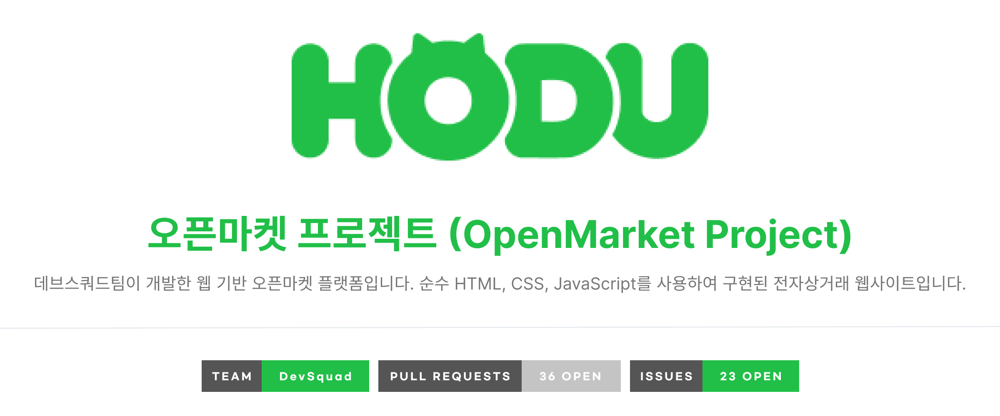

<!--Banner-->
 

## 📋 프로젝트 개요

이 프로젝트는 온라인 쇼핑몰의 핵심 기능들을 구현한 웹 애플리케이션입니다. 사용자는 상품을 검색하고, 상세 정보를 확인하며, 장바구니에 담고 구매할 수 있습니다.

## ✨ 주요 기능

- **상품 상세 페이지**: 개별 상품의 자세한 정보 확인
- **회원 관리**: 로그인/회원가입 기능
- **장바구니**: 선택한 상품들을 담고 관리

## 🏗️ 프로젝트 구조

```
root/
├── index.html                    # 메인 페이지 (상품 목록)
├── 404.html                      # 404 오류 페이지
│
├── pages/                        # 각 페이지별 HTML 파일
│   ├── login.html               # 로그인 페이지
│   ├── signup.html              # 회원가입 페이지
│   ├── product_detail.html      # 상품 상세 페이지
│   └── cart.html                # 장바구니 페이지
│
├── assets/                       # 정적 파일들
│   ├── css/                     # CSS 파일들
│   │   ├── reset.css            # 스타일 리셋
│   │   ├── common.css           # 공통 스타일
│   │   ├── main.css             # 메인 페이지 스타일
│   │   ├── products.css         # 상품 관련 스타일
│   │   └── components.css       # 컴포넌트별 스타일
│   │
│   ├── js/                      # JavaScript 파일들
│   │   ├── common.js            # 공통 함수
│   │   ├── api.js               # API 관련 함수
│   │   ├── utils.js             # 유틸리티 함수
│   │   ├── validation.js        # 입력 검증 함수
│   │   └── pages/               # 페이지별 JS 파일
│   │       ├── main.js
│   │       ├── login.js
│   │       └── products.js
│   │
│   ├── images/                  # 이미지 파일들
│   └── icons/                   # 아이콘 파일들
│
├── components/                   # 재사용 가능한 HTML 컴포넌트
│   ├── header.html              # 공통 헤더
│   ├── footer.html              # 공통 푸터
│   └── nav.html                 # 내비게이션
│
└── README.md                     # 프로젝트 설명서
```

## 🛠️ 기술 스택

- **Frontend**: HTML5, CSS3, JavaScript (ES6+)
- **스타일링**: BEM 방식의 CSS 클래스 네이밍
- **버전 관리**: Git/GitHub

## 📐 코딩 컨벤션

### 네이밍 규칙

| 대상                 | 규칙             | 예시                                   |
| -------------------- | ---------------- | -------------------------------------- |
| ID                   | camelCase        | `userName`, `fetchProducts`            |
| CSS 클래스           | BEM 방식         | `product-card__title`, `btn--primary`  |
| JavaScript 변수/함수 | camelCase        | `userName`, `fetchProducts`            |
| JavaScript 상수      | UPPER_SNAKE_CASE | `API_BASE_URL`, `MAX_ITEMS`            |
| 파일명               | kebab-case       | `product-detail.html`, `user-utils.js` |

### 커밋 메시지 규칙

```
type: 간단한 설명 (50자 이내)

feat: 새로운 기능 추가
fix: 버그 수정
style: CSS 스타일 변경
refactor: 코드 리팩토링
docs: 문서 수정
chore: 기타 작업
```

**예시:**

- `feat: 상품 상세 페이지 HTML 구조 구현`
- `fix: 모바일에서 네비게이션 메뉴 오류 수정`
- `style: 메인 페이지 반응형 CSS 개선`

## 🌿 브랜치 전략

| 브랜치명         | 용도                       |
| ---------------- | -------------------------- |
| `main`           | 항상 배포 가능한 상태 유지 |
| `dev`            | 개발 작업의 통합 브랜치    |
| `feature/기능명` | 새로운 기능 개발용         |

### 개발 워크플로우

1. **브랜치 생성**

    ```bash
    git checkout develop
    git pull origin develop
    git checkout -b feature/product-list
    ```

2. **작업 및 커밋**

    ```bash
    git add .
    git commit -m "feat: 상품 목록 페이지 HTML 구조 완성"
    ```

3. **Pull Request 생성**
    - `feature` → `develop`으로 PR 생성
    - 코드 리뷰 후 머지

4. **배포 준비**
    - `develop` → `main`으로 최종 머지

## 🚀 시작하기

1. **저장소 클론**

    ```bash
    git clone https://github.com/oreumiDevsquad/openmarket_project.git
    cd openmarket_project
    ```

2. **개발 서버 실행**
    - Live Server 확장 프로그램 사용 (VS Code)
    - 또는 로컬 웹 서버 실행

3. **브라우저에서 확인**
    - `http://localhost:3000` (또는 설정한 포트)에서 확인

## 🤝 기여하기

1. 이슈를 생성하거나 기존 이슈를 확인합니다
2. 새로운 브랜치를 생성합니다
3. 변경 사항을 커밋합니다
4. Pull Request를 생성합니다

### 이슈 템플릿

**🐞 버그 리포트**

- 어떤 버그인가요?
- 재현 방법
- 기대했던 결과
- 스크린샷 (필요시)

**✨ 기능 제안**

- 어떤 기능인가요?
- 왜 필요한가요?

## 📄 라이선스

이 프로젝트는 데브스쿼드팀의 교육용 프로젝트입니다.

## 👥 개발팀

- **데브스쿼드 개발팀 (oreumiDevsquad)**
- 프론트엔드 개발 교육 프로젝트

---

<div style="margin-top: 20px;">
 <span style="display:inline-block; background-color:rgb(0,0,0,0.2); width:40px; text-align:center; border-radius:5px;">URL</span> https://github.com/oreumiDevsquad/openmarket_project.git
</div>
